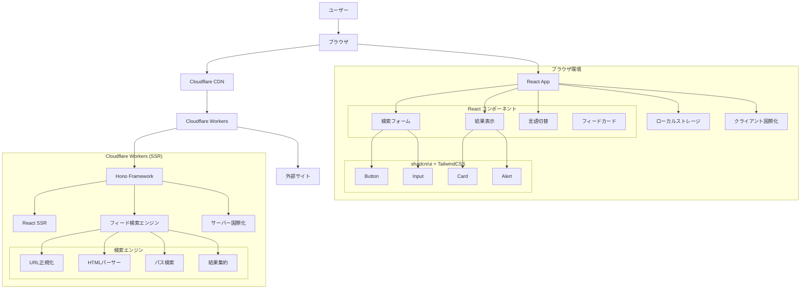
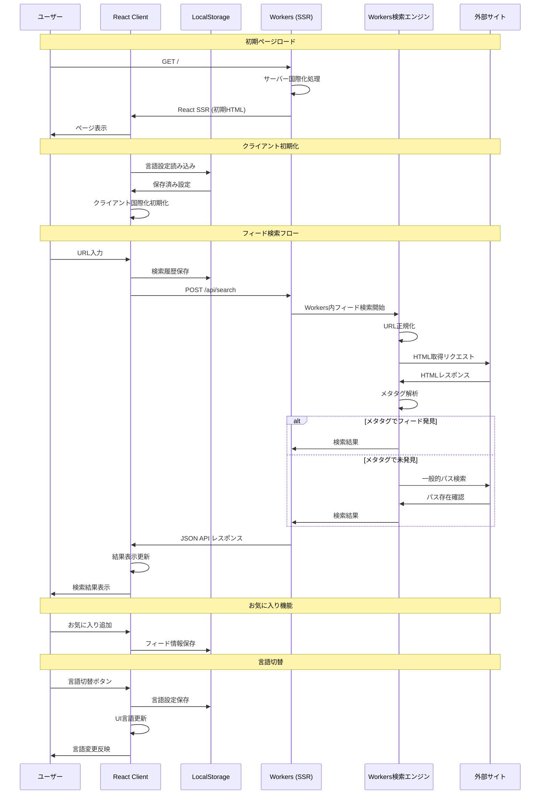

# Feed Finder 改良版 - 設計仕様書

## 概要

本設計書では、Feed Finder改良版のアーキテクチャ設計をArchitecture Decision Record（ADR）形式で記録します。各設計判断の背景、選択肢、決定理由を明確に文書化し、将来の保守や拡張時の参考とします。

## ADR-001: プラットフォーム選択

### ステータス
承認済み

### コンテキスト
Webアプリケーションのホスティングプラットフォームを選択する必要がある。要件として、高速なレスポンス、グローバル配信、コスト効率性が求められる。

### 検討した選択肢
1. **Cloudflare Workers** - エッジコンピューティングプラットフォーム
2. **Vercel** - フロントエンド特化のホスティング
3. **AWS Lambda** - サーバーレス関数
4. **従来のVPS** - 仮想プライベートサーバー

### 決定
Cloudflare Workersを選択

### 理由
- **パフォーマンス**: エッジロケーションでの実行により低レイテンシ
- **スケーラビリティ**: 自動スケーリングとグローバル配信
- **コスト**: 無料枠が充実、従量課金制
- **開発体験**: TypeScript対応、シンプルなデプロイ
- **既存実装**: 現在の実装がすでにWorkers環境で動作

### 影響
- Node.js固有のAPIは使用不可
- ランタイム制限（CPU時間、メモリ）に注意が必要
- Cloudflareエコシステムとの統合が容易

## ADR-002: Webフレームワーク選択

### ステータス
承認済み

### コンテキスト
Cloudflare Workers環境で動作するWebフレームワークを選択する必要がある。軽量性、型安全性、開発効率性が重要。

### 検討した選択肢
1. **Hono** - 軽量なWebフレームワーク
2. **Itty Router** - 最小限のルーター
3. **Worktop** - Workers専用フレームワーク
4. **生のFetch API** - フレームワークなし

### 決定
Honoを選択

### 理由
- **軽量性**: バンドルサイズが小さく、Workers環境に最適
- **型安全性**: TypeScript完全対応
- **機能性**: ミドルウェア、バリデーション、HTMLレスポンス対応
- **開発体験**: Express.jsライクなAPI
- **コミュニティ**: 活発な開発とドキュメント

### 影響
- Express.jsの知識が活用可能
- ミドルウェアによる機能拡張が容易
- 型安全なルーティングが実現

## ADR-003: エラーハンドリング戦略

### ステータス
承認済み

### コンテキスト
非同期処理とネットワーク通信を含むアプリケーションで、型安全で予測可能なエラーハンドリングが必要。

### 検討した選択肢
1. **neverthrow (Result型)** - 関数型エラーハンドリング
2. **try-catch** - 従来の例外処理
3. **Promise.catch()** - Promise基準のエラーハンドリング
4. **カスタムエラークラス** - 独自のエラー階層

### 決定
neverthrowのResult型を選択

### 理由
- **型安全性**: エラーが型レベルで表現される
- **明示性**: 関数シグネチャでエラーの可能性が明確
- **合成可能性**: andThen、orElseによる関数合成
- **予測可能性**: 例外による制御フローの中断がない

### 影響
- 学習コストが発生（関数型プログラミングの概念）
- すべての非同期処理でResultAsync型を使用
- エラーハンドリングが明示的になり、見落としが減少

## ADR-004: フロントエンドアーキテクチャ選択

### ステータス
承認済み

### コンテキスト
サーバーサイドレンダリング（SSR）環境でReactベースのコンポーネント開発を行い、保守性と開発効率を向上させる必要がある。

### 検討した選択肢
1. **React + Vite** - モダンなReact開発環境
2. **Vanilla JavaScript** - フレームワークなし
3. **Preact** - 軽量なReact代替
4. **Lit** - Web Components

### 決定
React + Viteを選択

### 理由
- **開発効率**: JSX/TSXによるコンポーネント開発
- **型安全性**: TypeScriptとの完全統合
- **エコシステム**: 豊富なライブラリとツール
- **SSR対応**: Hono JSXとの互換性
- **開発体験**: Hot Module Replacement、高速ビルド

### 影響
- バンドルサイズの増加（ただしCloudflare Workersの制限内）
- React開発者の知識が活用可能
- コンポーネントベースの設計が可能

## ADR-005: UIコンポーネントライブラリ選択

### ステータス
承認済み

### コンテキスト
React環境でアクセシブルで美しいUIコンポーネントを効率的に構築するためのライブラリが必要。WCAG 2.2準拠とカスタマイズ性が重要。

### 検討した選択肢
1. **shadcn/ui + TailwindCSS** - コピー&ペーストコンポーネント
2. **TailwindCSS + DaisyUI** - ユーティリティファースト + プリセット
3. **Chakra UI** - シンプルなコンポーネントライブラリ
4. **Mantine** - フル機能のUIライブラリ

### 決定
shadcn/ui + TailwindCSS v4 を選択

### 理由
- **カスタマイズ性**: コンポーネントを直接編集可能
- **アクセシビリティ**: Radix UIベースで高いアクセシビリティ
- **型安全性**: TypeScript完全対応
- **バンドルサイズ**: 必要なコンポーネントのみ追加
- **保守性**: 外部依存を最小化、コードの完全制御
- **デザインシステム**: 一貫したデザイントークン
- **最新機能**: TailwindCSS v4の新機能とパフォーマンス向上

### 影響
- 初期セットアップが必要
- コンポーネントの手動管理
- **TailwindCSS v4の学習が必要**: v3以前の書き方は使用せず、v4の新しい記法を採用
- 高度なカスタマイズが可能
- **重要**: すべてのスタイリングはTailwindCSS v4の記法で記述し、v3以前の古い書き方は避ける

## ADR-006: 国際化アーキテクチャ

### ステータス
承認済み

### コンテキスト
日本語と英語の2言語対応が必要。サーバーサイドレンダリング環境での効率的な国際化実装が求められる。

### 検討した選択肢
1. **クライアントサイド国際化** - JavaScriptによる動的切り替え
2. **サーバーサイド国際化** - HTMLレンダリング時に言語決定
3. **ハイブリッド方式** - 初期表示はサーバー、切り替えはクライアント
4. **静的ファイル生成** - 言語別の静的HTML生成

### 決定
ハイブリッド方式を選択

### 理由
- **初期表示速度**: サーバーサイドで言語決定、HTMLに埋め込み
- **UX**: クライアントサイドでの即座な言語切り替え
- **SEO**: 初期HTMLに適切な言語コンテンツが含まれる
- **実装コスト**: 複雑すぎず、効果的

### 影響
- ローカルストレージによる言語設定保存
- JavaScript無効環境でもデフォルト言語で動作
- 翻訳文字列の管理が必要

## ADR-007: フィード検索アルゴリズム

### ステータス
承認済み

### コンテキスト
効率的で網羅的なフィード検索を実現するアルゴリズムが必要。精度と性能のバランスが重要。

### 検討した選択肢
1. **HTMLメタタグのみ** - RSS Autodiscovery標準のみ
2. **パス検索のみ** - 一般的なフィードパスのみ
3. **並列検索** - メタタグとパス検索を同時実行
4. **段階的検索** - メタタグ優先、見つからない場合はパス検索

### 決定
段階的検索を選択

### 理由
- **効率性**: 不必要なHTTPリクエストを削減
- **精度**: 標準準拠のメタタグを優先
- **網羅性**: パス検索によるフォールバック
- **パフォーマンス**: 段階的実行により最適化

### 影響
- 検索方法の記録が必要（デバッグ用）
- 複雑な非同期フロー制御
- 重複フィードの除去処理が必要

## ADR-008: データ永続化戦略

### ステータス
承認済み

### コンテキスト
検索履歴とお気に入り機能のためのデータ永続化が必要。プライバシーとパフォーマンスを考慮。

### 検討した選択肢
1. **ローカルストレージ** - ブラウザローカル保存
2. **Cloudflare KV** - エッジストレージ
3. **Cloudflare D1** - SQLiteデータベース
4. **外部データベース** - PostgreSQL等

### 決定
ローカルストレージを選択（第一段階）

### 理由
- **プライバシー**: データがユーザーのブラウザに保存
- **パフォーマンス**: ネットワーク通信不要
- **実装コスト**: 追加インフラ不要
- **段階的実装**: 将来的にクラウドストレージに移行可能

### 影響
- デバイス間でのデータ同期不可
- ブラウザデータ削除でデータ消失
- ストレージ容量制限あり

## ADR-010: TailwindCSS バージョン戦略

### ステータス
承認済み

### コンテキスト
TailwindCSSのバージョン選択において、最新の機能とパフォーマンス向上を活用する必要がある。v4では大幅な改善が行われており、従来のv3以前とは記法が異なる。

### 検討した選択肢
1. **TailwindCSS v3** - 安定版、豊富なドキュメント
2. **TailwindCSS v4** - 最新版、パフォーマンス向上
3. **TailwindCSS v2** - 旧安定版
4. **カスタムCSS** - TailwindCSS不使用

### 決定
TailwindCSS v4を選択

### 理由
- **パフォーマンス**: v4での大幅な高速化
- **新機能**: 改善されたDX（開発者体験）
- **将来性**: 長期的なサポートとアップデート
- **モダンな記法**: より直感的で効率的な書き方
- **バンドルサイズ**: さらなる最適化

### 影響
- **重要制約**: v3以前の記法は使用禁止、すべてv4記法で統一
- 学習コストの発生（v3からの移行）
- ドキュメントがv4準拠である必要
- 開発チーム全体でのv4記法の習得が必要

## ADR-011: アクセシビリティ実装方針

### ステータス
承認済み

### コンテキスト
WCAG 2.2 AA準拠のアクセシブルなWebアプリケーションを構築する必要がある。

### 検討した選択肢
1. **セマンティックHTML + ARIA** - 標準的なアプローチ
2. **アクセシビリティライブラリ** - 専用ライブラリ使用
3. **後付け対応** - 基本機能完成後に対応
4. **最小限対応** - 基本的な対応のみ

### 決定
セマンティックHTML + ARIAを選択

### 理由
- **標準準拠**: Web標準に基づく実装
- **保守性**: 追加ライブラリへの依存なし
- **パフォーマンス**: 軽量な実装
- **将来性**: 標準の進化に追従可能

### 影響
- HTML構造の慎重な設計が必要
- ARIAラベルの適切な実装
- キーボードナビゲーションの実装
- 色覚異常対応の配色設計
- **WCAG 2.2 追加要件**:
  - フォーカス時の要素が他のUI要素で隠れないよう設計
  - タッチターゲット（ボタン、リンク）の最小サイズを24×24px以上に設定
  - ドラッグ操作がある場合は代替手段を提供（現在は該当なし）

## システムアーキテクチャ

### 全体構成図



### データフロー図



## コンポーネント設計

### 1. フィード検索エンジン

```typescript
interface FeedSearchEngine {
  searchFeeds(url: string): ResultAsync<SearchResult, FeedSearchError>;
  normalizeUrl(url: string): Result<string, FeedSearchError>;
  extractFromHtml(html: string, baseUrl: string): FeedResult[];
  searchCommonPaths(baseUrl: string): ResultAsync<FeedResult[], FeedSearchError>;
}
```

### 2. 国際化システム

```typescript
interface I18nSystem {
  getCurrentLanguage(): Language;
  setLanguage(lang: Language): void;
  translate(key: string, params?: Record<string, string>): string;
  getMessages(lang: Language): Messages;
}
```

### 3. ストレージマネージャー

```typescript
interface StorageManager {
  saveSearchHistory(url: string): void;
  getSearchHistory(): string[];
  saveFavorite(feed: FeedResult): void;
  getFavorites(): FeedResult[];
  clearHistory(): void;
}
```

### 4. UIコンポーネント

```typescript
// React コンポーネント
interface SearchFormProps {
  currentUrl?: string;
  onSubmit: (url: string) => void;
}

interface ResultsProps {
  result: SearchResult;
  language: Language;
}

interface ErrorDisplayProps {
  error: FeedSearchError;
  language: Language;
}

interface LanguageToggleProps {
  currentLang: Language;
  onLanguageChange: (lang: Language) => void;
}
```

## セキュリティ設計

### XSS対策
- すべてのユーザー入力をHTMLエスケープ
- Content Security Policy (CSP) の実装
- SRI (Subresource Integrity) による外部リソース検証

### プライバシー保護
- ローカルストレージによるデータ保存
- 外部への不要なデータ送信なし
- ユーザー追跡の回避

### ネットワークセキュリティ
- HTTPS強制
- 適切なUser-Agentの設定
- レート制限の実装（将来）

## パフォーマンス設計

### 最適化戦略
- HEADリクエストによる効率的な存在確認
- 段階的検索による不要リクエスト削減
- CDNによる静的リソース配信
- エッジコンピューティングによる低レイテンシ
- **非同期処理の積極活用**: 複数のフィードパス検索、外部サイトへのリクエストなど、並列実行可能な処理は積極的に非同期化してスケーラビリティを確保
- **Promise.all()による並列処理**: 独立した複数のHTTPリクエストを同時実行
- **ResultAsync合成**: neverthrowライブラリを活用した非同期エラーハンドリングの最適化

### 監視指標
- 検索レスポンス時間
- フィード発見率
- エラー発生率
- ユーザー満足度

## 拡張性設計

### 将来の拡張ポイント
1. **認証システム**: ユーザーアカウント機能
2. **クラウドストレージ**: デバイス間同期
3. **API提供**: 外部サービス連携
4. **バッチ処理**: 大量URL処理
5. **フィード分析**: 詳細情報提供

### アーキテクチャ進化
- マイクロサービス化の可能性
- GraphQL APIの導入
- リアルタイム機能の追加
- 機械学習による精度向上