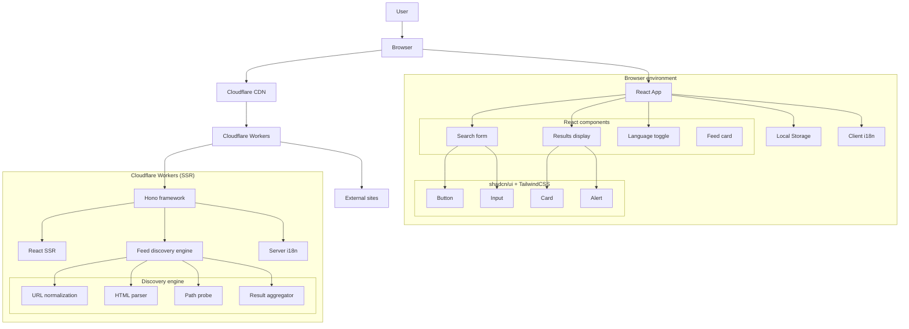
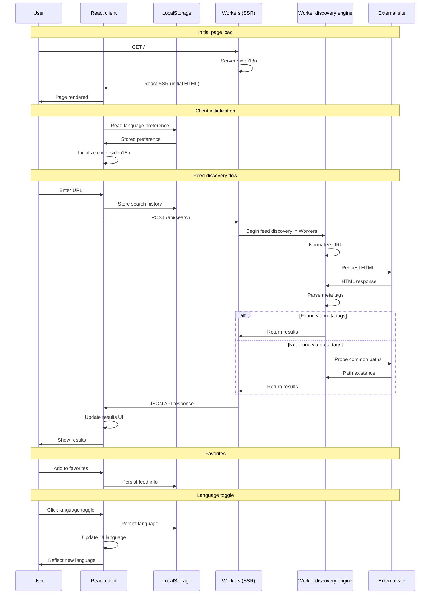

# Feed Finder - Design Specification

## Overview

This document records architectural decisions for Feed Finder in Architecture Decision Record (ADR) form. Each decision documents the context, options considered, and rationale, so future maintenance and extension work can refer back to it.

## ADR-001: Platform Selection

### Status

Approved

### Context

The web application needs a hosting platform that delivers fast responses, global distribution, and cost efficiency.

### Options Considered

1. **Cloudflare Workers** — edge computing platform.
2. **Vercel** — frontend-focused hosting.
3. **AWS Lambda** — serverless functions.
4. **Traditional VPS** — virtual private server.

### Decision

Adopt Cloudflare Workers.

### Rationale

- **Performance**: low latency thanks to edge execution.
- **Scalability**: automatic scaling and global distribution.
- **Cost**: generous free tier with usage-based billing.
- **Developer experience**: TypeScript support and a simple deploy story.
- **Existing implementation**: the current codebase already targets Workers.

### Consequences

- Node.js-specific APIs are unavailable.
- Runtime limits (CPU time, memory) require attention.
- Tight integration with the rest of the Cloudflare ecosystem.

## ADR-002: Web Framework Selection

### Status

Approved

### Context

We need a web framework that runs in the Cloudflare Workers environment. Light weight, type safety, and developer productivity are key.

### Options Considered

1. **Hono** — lightweight web framework.
2. **Itty Router** — minimal router.
3. **Worktop** — Workers-specific framework.
4. **Raw Fetch API** — no framework.

### Decision

Adopt Hono.

### Rationale

- **Light weight**: small bundle size, ideal for Workers.
- **Type safety**: full TypeScript support.
- **Features**: middleware, validation, and HTML response support.
- **Developer experience**: Express.js-like API.
- **Community**: active development and documentation.

### Consequences

- Existing Express.js knowledge transfers well.
- Easy to extend through middleware.
- Routing remains type safe.

## ADR-003: Error Handling Strategy

### Status

Approved

### Context

Our app combines async work and network I/O, so we need predictable, type-safe error handling.

### Options Considered

1. **neverthrow (Result type)** — functional error handling.
2. **try / catch** — traditional exceptions.
3. **Promise.catch()** — Promise-based error handling.
4. **Custom error classes** — bespoke error hierarchy.

### Decision

Adopt neverthrow's Result type.

### Rationale

- **Type safety**: errors are expressed at the type level.
- **Explicitness**: function signatures make error possibilities obvious.
- **Composability**: combinators like `andThen` / `orElse`.
- **Predictability**: control flow is not interrupted by exceptions.

### Consequences

- A learning curve (functional programming concepts).
- Use `ResultAsync` for every async pipeline.
- Error handling becomes explicit, reducing oversights.

## ADR-004: Frontend Architecture Selection

### Status

Approved

### Context

We want React-based component development running in a server-side rendering (SSR) environment to improve maintainability and developer productivity.

### Options Considered

1. **React + Vite** — modern React stack.
2. **Vanilla JavaScript** — no framework.
3. **Preact** — lightweight React alternative.
4. **Lit** — Web Components.

### Decision

Adopt React + Vite.

### Rationale

- **Productivity**: components authored in JSX/TSX.
- **Type safety**: complete integration with TypeScript.
- **Ecosystem**: rich library and tooling support.
- **SSR support**: compatible with Hono JSX.
- **Developer experience**: hot module replacement and fast builds.

### Consequences

- Larger bundle (still within Workers' limits).
- React knowledge in the team transfers directly.
- Component-based design is straightforward.

## ADR-005: UI Component Library Selection

### Status

Approved

### Context

We need accessible, polished React UI components, with WCAG 2.2 compliance and customizability.

### Options Considered

1. **shadcn/ui + TailwindCSS** — copy-paste components.
2. **TailwindCSS + DaisyUI** — utility-first plus presets.
3. **Chakra UI** — simple component library.
4. **Mantine** — full-featured UI library.

### Decision

Adopt shadcn/ui + TailwindCSS v4.

### Rationale

- **Customizability**: components are editable in place.
- **Accessibility**: built on Radix UI for strong defaults.
- **Type safety**: complete TypeScript support.
- **Bundle size**: only the components we need ship.
- **Maintainability**: minimal external dependencies; we own the code.
- **Design system**: consistent design tokens.
- **Modern features**: TailwindCSS v4 brings new capabilities and speed.

### Consequences

- Initial setup is required.
- Components are managed by hand.
- **TailwindCSS v4 must be learned**: pre-v4 syntax is forbidden; we use only v4 syntax.
- Deep customization is possible.
- **Important**: all styles use TailwindCSS v4 syntax; pre-v4 syntax is avoided.

## ADR-006: Internationalization Architecture

### Status

Approved

### Context

We need bilingual (Japanese / English) support, with internationalization that works in an SSR setup.

### Options Considered

1. **Client-side i18n** — switch dynamically in JavaScript.
2. **Server-side i18n** — pick the language during HTML render.
3. **Hybrid** — server-rendered initial paint, client-driven switching.
4. **Static generation** — pre-render per-language HTML.

### Decision

Adopt the hybrid approach.

### Rationale

- **Initial paint speed**: language is decided server-side and embedded in the HTML.
- **UX**: instant language switching on the client.
- **SEO**: the initial HTML carries the right language content.
- **Cost**: not too complex, but effective.

### Consequences

- Language preference is persisted in local storage.
- The default language still works without JavaScript.
- Translation strings need to be maintained.

## ADR-007: Feed Discovery Algorithm

### Status

Approved

### Context

We need an algorithm that is both efficient and exhaustive for feed discovery; a balance of accuracy and speed is essential.

### Options Considered

1. **HTML meta tags only** — RSS Autodiscovery only.
2. **Path probing only** — common feed paths only.
3. **Parallel search** — meta tags and paths concurrently.
4. **Staged search** — prefer meta tags, fall back to path probes.

### Decision

Adopt staged search.

### Rationale

- **Efficiency**: avoids unnecessary HTTP requests.
- **Accuracy**: prefers standards-conformant meta tags.
- **Coverage**: falls back to path probing.
- **Performance**: optimized via the staged execution.

### Consequences

- Each feed must record which method discovered it (for debugging).
- Async control flow gets more involved.
- Duplicates need to be removed.

## ADR-008: Data Persistence Strategy

### Status

Approved

### Context

The search-history and favorites features need persistent storage. Privacy and performance matter.

### Options Considered

1. **Local storage** — browser-local storage.
2. **Cloudflare KV** — edge key-value store.
3. **Cloudflare D1** — SQLite database.
4. **External database** — e.g., PostgreSQL.

### Decision

Adopt local storage (first phase).

### Rationale

- **Privacy**: data stays in the user's browser.
- **Performance**: no network round-trips needed.
- **Cost**: no additional infrastructure.
- **Phased approach**: can migrate to cloud storage later if needed.

### Consequences

- No cross-device sync.
- Clearing browser data wipes the state.
- Storage is capped by browser quotas.

## ADR-010: TailwindCSS Versioning Strategy

### Status

Approved

### Context

We want the latest TailwindCSS features and performance. v4 introduces large changes and a new syntax incompatible with pre-v4.

### Options Considered

1. **TailwindCSS v3** — stable, well-documented.
2. **TailwindCSS v4** — newest, faster.
3. **TailwindCSS v2** — older stable version.
4. **Custom CSS** — no Tailwind at all.

### Decision

Adopt TailwindCSS v4.

### Rationale

- **Performance**: significant speed-ups in v4.
- **New features**: improved DX (developer experience).
- **Future-proofing**: long-term support and updates.
- **Modern syntax**: more intuitive and efficient.
- **Bundle size**: further optimizations.

### Consequences

- **Hard constraint**: pre-v4 syntax is forbidden; everything uses v4 syntax.
- Migration cost (learning v4).
- Documentation must be v4-conformant.
- Whole team needs to learn v4 syntax.

## ADR-011: CI/CD Pipeline Strategy

### Status

Approved

### Context

We need continuous integration and continuous delivery to keep code quality high and deployments efficient. We need a CI/CD strategy that fits the Cloudflare Workers environment.

### Options Considered

1. **GitHub Actions** — GitHub-native and ecosystem-rich.
2. **GitLab CI/CD** — integrated DevOps platform.
3. **Cloudflare Workers CI/CD** — Cloudflare-specific tooling.
4. **Manual deploys** — no CI/CD.

### Decision

Adopt GitHub Actions plus manual deploys.

### Rationale

- **Integration**: works seamlessly with the GitHub repo.
- **Ecosystem**: rich Actions marketplace.
- **Cost**: free for public repositories.
- **Cloudflare support**: integrates well with `wrangler`.
- **Security**: manual deploys give us control and reduce risk.
- **Flexibility**: easy to author custom workflows.

### Consequences

- Requires a GitHub repository.
- Workflow config lives under `.github/workflows/`.
- Manual deploys mean cautious release management.
- CI/CD pipeline is fast (pre-push: 0.41 s).

## ADR-012: Git Hook Strategy

### Status

Approved

### Context

We need to run code-quality checks automatically on commit and push, so problematic code does not enter the repository — without sacrificing developer productivity.

### Options Considered

1. **lefthook** — fast, with simple configuration.
2. **husky** — popular in the Node.js ecosystem.
3. **pre-commit** — Python-based tool.
4. **Manual checks** — no hooks.

### Decision

Adopt lefthook.

### Rationale

- **Performance**: fast (Go-based).
- **Concise config**: intuitive YAML configuration.
- **Parallel execution**: runs multiple checks concurrently.
- **Cross-platform**: stable on every OS we use.
- **Light weight**: few dependencies.

### Consequences

- Configuration lives in `lefthook.yml`.
- pre-commit and pre-push hooks run automatically.
- `staged_files` and `push_files` are processed efficiently.
- Developers need a one-time setup.
- **Implementation improvements**:
  - Added TypeScript type checks (`tsc --noEmit`).
  - Added dependency vulnerability checks via `npm audit`.
  - Sped up pre-push (4.89 s → 0.41 s, 92% faster).

## ADR-013: Test-Driven Development (TDD) Strategy

### Status

Approved

### Context

In an agentic-coding setup (AI agents writing code), we need to apply t-wada style TDD to produce high-quality, maintainable code efficiently. The TDD process must be easy for AI agents to understand and follow.

### Options Considered

1. **t-wada style TDD** — strict Red-Green-Refactor cycle.
2. **Standard TDD** — generic test-first development.
3. **Tests written after** — tests added after the implementation.
4. **No tests** — skip testing entirely.

### Decision

Adopt t-wada style TDD, optimized for agentic coding.

### Rationale

- **Clear process**: a procedure that AI agents can follow.
- **Quality**: test-first leads to higher quality code.
- **Refactoring safety**: tests make changes safe.
- **Spec clarity**: tests act as living specs.
- **Debugging efficiency**: defects are caught early and locally.

### Consequences

- **Strict Red-Green-Refactor**: clearly separated steps.
- **Tests first**: never write implementation before the test.
- **Small steps**: implement one thing at a time.
- **Continuous refactoring**: refactoring after Green is mandatory.

### Optimizations for Agentic Coding

#### 1. Test phase (Red)

```typescript
// 1. Write a failing test first
describe("normalizeUrl", () => {
  it("should add https protocol to URL without protocol", () => {
    const result = normalizeUrl("example.com");
    expect(result.isOk()).toBe(true);
    expect(result.value).toBe("https://example.com");
  });
});
```

#### 2. Minimum-implementation phase (Green)

```typescript
// 2. The minimum implementation that makes the test pass
function normalizeUrl(url: string): Result<string, FeedSearchError> {
  if (!url.startsWith("http")) {
    return ok(`https://${url}`);
  }
  return ok(url);
}
```

#### 3. Refactor phase

```typescript
// 3. Improve the code (without touching the tests)
function normalizeUrl(url: string): Result<string, FeedSearchError> {
  try {
    const parsed = new URL(url.startsWith("http") ? url : `https://${url}`);
    return ok(parsed.toString());
  } catch {
    return err({ type: "invalid-url", message: "Invalid URL format" });
  }
}
```

## ADR-014: Accessibility Implementation Approach

### Status

Approved

### Context

We need to build a WCAG 2.2 AA compliant accessible web application.

### Options Considered

1. **Semantic HTML + ARIA** — the standard approach.
2. **Accessibility libraries** — purpose-built libraries.
3. **Retrofit later** — handle a11y after the basics ship.
4. **Minimal coverage** — only the basics.

### Decision

Adopt semantic HTML + ARIA.

### Rationale

- **Standards-based**: built on web standards.
- **Maintainability**: no dependency on extra libraries.
- **Performance**: a lighter implementation.
- **Future-proofing**: tracks the standards as they evolve.

### Consequences

- HTML structure must be designed carefully.
- ARIA labels need to be applied appropriately.
- Keyboard navigation must be implemented.
- Color choices need to support colorblind users.
- **Additional WCAG 2.2 requirements**:
  - Ensure focused elements are not obscured by other UI.
  - Touch targets (buttons, links) must be at least 24×24px.
  - When drag operations exist, provide alternatives (none currently).

## System Architecture

### Overall Diagram


```mermaid
graph TB
    User[User] --> Browser[Browser]
    Browser --> CDN[Cloudflare CDN]
    CDN --> Workers[Cloudflare Workers]
    Workers --> External[External sites]

    subgraph "Browser environment"
        React[React App]
        LocalStorage[Local Storage]
        I18nClient[Client i18n]

        subgraph "React components"
            SearchForm[Search form]
            ResultDisplay[Results display]
            LanguageToggle[Language toggle]
            FeedCard[Feed card]
        end

        subgraph "shadcn/ui + TailwindCSS"
            Button[Button]
            Input[Input]
            Card[Card]
            Alert[Alert]
        end
    end

    subgraph "Cloudflare Workers (SSR)"
        Hono[Hono framework]
        ReactSSR[React SSR]
        Search[Feed discovery engine]
        I18nServer[Server i18n]

        subgraph "Discovery engine"
            URLNormalizer[URL normalization]
            HTMLParser[HTML parser]
            PathSearcher[Path probe]
            ResultAggregator[Result aggregator]
        end
    end

    Browser --> React
    React --> SearchForm
    React --> ResultDisplay
    React --> LanguageToggle
    React --> LocalStorage
    React --> I18nClient

    SearchForm --> Button
    SearchForm --> Input
    ResultDisplay --> Card
    ResultDisplay --> Alert

    Workers --> Hono
    Hono --> ReactSSR
    Hono --> Search
    Hono --> I18nServer

    Search --> URLNormalizer
    Search --> HTMLParser
    Search --> PathSearcher
    Search --> ResultAggregator
```

### Data Flow Diagram


```mermaid
sequenceDiagram
    participant U as User
    participant RC as React client
    participant LS as LocalStorage
    participant W as Workers (SSR)
    participant SE as Worker discovery engine
    participant E as External site

    Note over U,E: Initial page load
    U->>W: GET /
    W->>W: Server-side i18n
    W->>RC: React SSR (initial HTML)
    RC->>U: Page rendered

    Note over U,E: Client initialization
    RC->>LS: Read language preference
    LS->>RC: Stored preference
    RC->>RC: Initialize client-side i18n

    Note over U,E: Feed discovery flow
    U->>RC: Enter URL
    RC->>LS: Store search history
    RC->>W: POST /api/search
    W->>SE: Begin feed discovery in Workers

    SE->>SE: Normalize URL
    SE->>E: Request HTML
    E->>SE: HTML response
    SE->>SE: Parse meta tags

    alt Found via meta tags
        SE->>W: Return results
    else Not found via meta tags
        SE->>E: Probe common paths
        E->>SE: Path existence
        SE->>W: Return results
    end

    W->>RC: JSON API response
    RC->>RC: Update results UI
    RC->>U: Show results

    Note over U,E: Favorites
    U->>RC: Add to favorites
    RC->>LS: Persist feed info

    Note over U,E: Language toggle
    U->>RC: Click language toggle
    RC->>LS: Persist language
    RC->>RC: Update UI language
    RC->>U: Reflect new language
```

## Component Design

### 1. Feed Discovery Engine

```typescript
interface FeedSearchEngine {
  searchFeeds(url: string): ResultAsync<SearchResult, FeedSearchError>;
  normalizeUrl(url: string): Result<string, FeedSearchError>;
  extractFromHtml(html: string, baseUrl: string): FeedResult[];
  searchCommonPaths(
    baseUrl: string
  ): ResultAsync<FeedResult[], FeedSearchError>;
}
```

### 2. Internationalization System

```typescript
interface I18nSystem {
  getCurrentLanguage(): Language;
  setLanguage(lang: Language): void;
  translate(key: string, params?: Record<string, string>): string;
  getMessages(lang: Language): Messages;
}
```

### 3. Storage Manager

```typescript
interface StorageManager {
  saveSearchHistory(url: string): void;
  getSearchHistory(): string[];
  saveFavorite(feed: FeedResult): void;
  getFavorites(): FeedResult[];
  clearHistory(): void;
}
```

### 4. UI Components

```typescript
// React components
interface SearchFormProps {
  currentUrl?: string;
  onSubmit: (url: string) => void;
}

interface ResultsProps {
  result: SearchResult;
  language: Language;
}

interface ErrorDisplayProps {
  error: FeedSearchError;
  language: Language;
}

interface LanguageToggleProps {
  currentLang: Language;
  onLanguageChange: (lang: Language) => void;
}
```

## Security Design

### XSS Prevention

- HTML-escape every user input.
- Implement a Content Security Policy (CSP).
- Verify external resources via Subresource Integrity (SRI).

### Privacy

- Persist data in local storage.
- Do not send unnecessary data externally.
- Avoid user tracking.

### Network Security

- Enforce HTTPS.
- Set an appropriate User-Agent.
- Plan for rate limiting (future).

## Performance Design

### Optimization Strategies

- Use HEAD requests for efficient existence checks.
- Reduce unnecessary requests via staged search.
- Serve static resources from a CDN.
- Achieve low latency through edge computing.
- **Embrace async**: parallelize the work that can run concurrently — multiple feed-path probes, outbound site requests, and so on — to keep the system scalable.
- **Promise.all() for parallelism**: run independent HTTP requests concurrently.
- **ResultAsync composition**: optimize async error handling with neverthrow.

### Monitoring Metrics

- Search response time.
- Feed discovery rate.
- Error rate.
- User satisfaction.

## ADR-015: CI/CD Performance Optimization Strategy

### Status

Approved

### Context

Git hook execution time has a big impact on developer experience, so the CI/CD pipeline needs to be fast. In particular, pre-push was running for 4.89 seconds and slowing developers down.

### Options Considered

1. **Check every file** — reliable but slow.
2. **Check only changed files** — fast but riskier.
3. **Staged checks** — basics in pre-commit, minimum in pre-push.
4. **Run in parallel** — multiple tasks at the same time.

### Decision

Adopt staged checks plus file scoping.

### Rationale

- **Developer experience**: 4.89 s → 0.41 s (92% faster).
- **Quality preserved**: keep the important checks.
- **Efficiency**: scope to the `src` directory.
- **Practicality**: a speed developers can actually live with.

### Consequences

- pre-push only inspects the `src` directory.
- Generated files (`*.d.ts`) are excluded.
- Biome configuration is optimized.
- GitHub Actions still runs the full set of checks.

## ADR-016: HTML Parsing Strategy

### Status

Approved

### Context

For HTML meta-tag analysis in the feed discovery engine, we need a lightweight and high-performance HTML parser, mindful of Cloudflare Workers constraints.

### Options Considered

1. **node-html-parser** — light, fast, runs on Workers.
2. **jsdom** — full DOM, but heavy.
3. **cheerio** — jQuery-like, server-side focused.
4. **Regular expressions** — light but inaccurate.

### Decision

Adopt `node-html-parser`.

### Rationale

- **Light weight**: small bundle, ideal for Workers.
- **Performance**: fast parsing.
- **Workers compatibility**: confirmed to work on Cloudflare Workers.
- **Functionality**: enough for RSS Autodiscovery meta-tag parsing.
- **Type safety**: TypeScript support.

### Consequences

- HTML meta-tag parsing is feasible.
- We can detect RSS / Atom feeds.
- A lightweight parser keeps things fast.

## Extensibility

### Future Extension Points

1. **Authentication**: user accounts.
2. **Cloud storage**: cross-device sync.
3. **Public API**: integrations with external services.
4. **Batch processing**: large-scale URL handling.
5. **Feed analytics**: deeper metadata.

### Architectural Evolution

- Possible move toward microservices.
- A GraphQL API.
- Real-time features.
- ML-based accuracy improvements.
